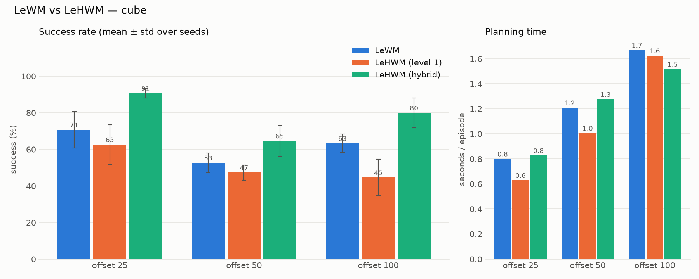

# LeHWM

An attempt to improve [LeWM](https://github.com/lucas-maes/le-wm) by adding a hierarchical level on top of it.  
The hybrid planner beats the [LeWM paper](https://arxiv.org/abs/2603.19312) (March 2026) on cube: 90.7 % vs 70.7 % success at goal offset 25.  
The goal is to beat the state of the art in this area (Quantara for now 93%).



```bash
python train.py name=my_run
python benchmark.py my_run --methods lewm hwm hwm-hybrid --goal-offsets 25 50 100
```
